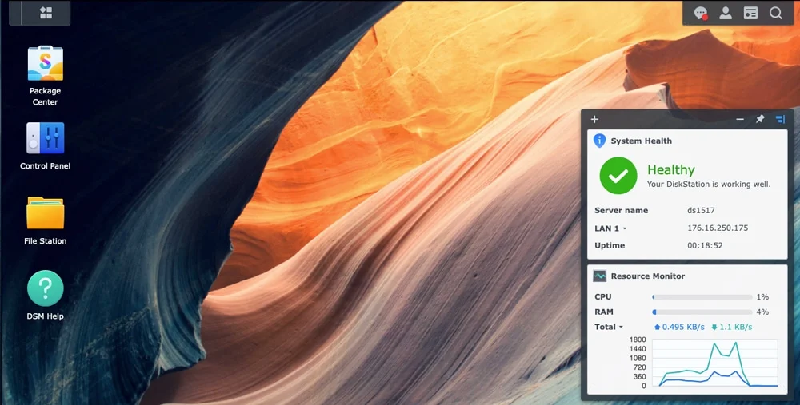

Synology DSM is one of the nicest NAS operating systems around, but it normally only runs on Synology's own hardware. **Xpenology** is the community way of running it anywhere else, including as a virtual machine. In this post I explain what Xpenology and the Arc Loader are, and then walk through deploying a DSM VM on Proxmox VE, step by step.

<!-- truncate -->

## What is Xpenology?



**DSM (DiskStation Manager)** is the operating system that ships with Synology NAS devices. It gives you a clean web interface for storage management, file sharing (SMB, NFS), user and permission management, backups, containers, and a large catalog of packages.

Normally DSM only boots on a real Synology box. **Xpenology** is not an operating system by itself. It is the name of the community effort that makes DSM boot on hardware Synology never made: a desktop PC, a spare server, or a virtual machine.

For a homelab this is attractive. You are not limited to the CPU, RAM, disk bays, and network ports of a specific Synology model. You can reuse whatever you already have, or simply try DSM inside a VM without buying anything.

## How does it work?

DSM expects to find a Synology device underneath it: a known model name, a serial number, specific hardware. A generic PC or VM does not look like that, so a small piece of software called a **loader** sits in front of DSM.

The loader boots first, presents the identity and settings DSM wants to see, and then hands control to the DSM kernel. The boot flow looks roughly like this:

```text
BIOS / UEFI
     │
     ▼
  Loader  (small boot disk)
     │
     ▼
    DSM   (installed on the data disks)
     │
     ▼
 NAS services (SMB, NFS, iSCSI, apps ...)
```

This also explains the disk layout you will see later in the VM: the loader lives on its own tiny disk, and DSM is installed onto separate data disks.

## What is Arc Loader?

There are a few different loaders in the Xpenology world. **Arc Loader** (by AuxXxilium) is the one used in this post, and it is popular because it takes most of the manual work out of the process:

- It is **menu driven**. You choose a model, a DSM version, and some options, and Arc builds the loader for you. No hand-editing config files.
- It **downloads the DSM installation file** for you during the build.
- It **generates the serial number and MAC addresses** that DSM will use.
- It ships as a ready-to-use disk image, which is easy to import into Proxmox.
- It has a built-in **web terminal** on port `7080`, so you can drive the menu from a browser instead of the Proxmox console.

## Before you start

Xpenology is a great way to learn and to build a homelab NAS, but there are a few things worth knowing up front.

:::warning
Xpenology is unofficial and unsupported. DSM is designed to run on Synology hardware, and Synology will not help you if something breaks on other hardware. Updates can also break an Xpenology install, so treat it as a lab and learning tool, not as a place for data you cannot lose.
:::

- **RAID and redundancy are not a backup.** If a file is deleted by mistake, every disk in the array agrees that it is gone. Keep a separate backup of anything important.
- **Be careful with updates.** A DSM update that is fine on a real Synology can fail on Xpenology. Take a Proxmox snapshot or backup before every DSM update, and turn off automatic updates.
- **A virtual disk is not redundancy.** A single VM disk on a single Proxmox node is exactly one copy of your data.

## Requirements

- A Proxmox VE host with internet access
- A network bridge with internet access (this post uses `vmbr0`)
- A storage target for VM disks (this post uses `local-lvm`; use whatever you have)
- A DHCP server on the network, or be ready to set a static IP in DSM afterwards
- Suggested VM resources: 2 vCPU, 4 GB RAM, and as much data disk as you like

## Step 1: Download the Arc image

On the Proxmox host, download the latest Arc release from the project's GitHub releases page (`github.com/AuxXxilium/arc`). The asset is a zip file with a single `.img` inside.

```bash
cd /tmp
wget <URL of the arc-<version>.img.zip asset from the releases page>
unzip arc-*.img.zip
ls -lh arc-*.img
```

If `unzip` is missing, install it with `apt install -y unzip`.

## Step 2: Create the VM

I use two shell variables so the commands can be copy-pasted. Change them to fit your host.

```bash
VMID=100
STORAGE=local-lvm
```

Create the VM without any disks. The loader image is imported as a disk in the next step.

```bash
qm create $VMID \
  --name xpenology-dsm \
  --ostype l26 \
  --machine q35 \
  --cpu host \
  --sockets 1 --cores 2 \
  --memory 4096 --balloon 0 \
  --net0 virtio,bridge=vmbr0
```

A few notes on those options:

- `--cpu host` passes the real CPU features to the guest. DSM and some of its packages can be picky about CPU flags, and `host` avoids most surprises.
- `--balloon 0` turns off memory ballooning. A NAS operating system does not like having its memory taken away behind its back.
- VirtIO is fine for the NIC in most cases. If Arc does not detect it later, switch to `e1000`: `qm set $VMID --net0 e1000,bridge=vmbr0`.

## Step 3: Import the loader and add a data disk

Import the Arc image and attach it as **SATA0**:

```bash
qm importdisk $VMID /tmp/arc-<version>.img $STORAGE
qm set $VMID --sata0 $STORAGE:vm-$VMID-disk-0
```

:::note
On file-based storage (like a directory storage) the imported disk may have a different name, for example `vm-100-disk-0.raw`. Run `qm config $VMID` and look for the `unused0` line to see the exact name to attach.
:::

Now add the data disk as **SATA1**. The number after the colon is the size in GB:

```bash
qm set $VMID --sata1 $STORAGE:50
```

Finally, make the loader disk the boot device:

```bash
qm set $VMID --boot order=sata0
```

:::tip
Use **SATA** for both the loader and the data disks. DSM expects SATA-style disks, and disks attached as VirtIO or SCSI are often not offered as installable drives.
:::

Check the result:

```bash
qm config $VMID
```

You should see `sata0` (the loader), `sata1` (the data disk), `net0`, and `boot: order=sata0`.

## Step 4: Boot and build the loader

Start the VM and open its console in the Proxmox web UI:

```bash
qm start $VMID
```

Arc shows a text menu and prints the IP address the VM received, along with the address of its web terminal:

```text
http://<vm-ip>:7080
```

You can continue in the Proxmox console, but the web terminal is nicer to work with. Menu labels differ a little between Arc versions, but the flow is always the same:

1. **Choose a model.** Pick one from the list Arc offers. The model decides things like the maximum number of disks and which CPU features are required, so read the notes Arc shows.
2. **Choose a DSM version.** Pick a DSM 7.x release.
3. **Review the options.** Arc generates a serial number and MAC address for the VM. Write them down. If you ever recreate the VM, reuse the same values so DSM recognizes it as the same device.
4. **Pick addons** if you want any. Skipping them is fine for a first install.
5. **Build the loader.** Arc downloads the DSM file from Synology, so the VM needs internet access for this step.
6. **Boot the loader.** Arc restarts into the DSM installer.

:::note
If the build fails while downloading, check DNS and the default gateway on the network the VM is attached to. Arc can also use a DSM file that you download yourself and provide manually.
:::

## Step 5: Install DSM

After the loader boots, the VM looks like a brand new, uninstalled Synology device. From your laptop:

- open `http://<vm-ip>:5000`, or
- open `find.synology.com` from a machine on the same network.

Then:

1. Click **Install**. DSM installs itself onto the data disk and the VM reboots once or twice.
2. Create your admin account.
3. Finish the setup wizard. You can skip the Synology account and QuickConnect options.

When the DSM desktop appears, you are done. From here you can create a storage pool and volume, set up shared folders, and install packages like on any other Synology.

## Step 6: Autostart and snapshots

Make the VM start together with the Proxmox host:

```bash
qm set $VMID --onboot 1
```

And before touching anything risky, such as a DSM update or a loader rebuild, take a snapshot:

```bash
qm snapshot $VMID before-update
```

To roll back if something goes wrong: `qm rollback $VMID before-update`.

## Troubleshooting

| Problem | What to check |
|---|---|
| Arc does not show an IP address | The NIC model may not be detected. Switch `net0` to `e1000` and reboot the VM. |
| `find.synology.com` cannot find the VM | Open `http://<vm-ip>:5000` directly, and make sure your laptop is on the same network as the VM. |
| The installer says no disk was found | The data disk must be attached as **SATA** (`sata1`), not VirtIO or SCSI. |
| Arc fails to download DSM | Check internet access and DNS from the VM, or provide the DSM file manually. |
| Black screen after installing | Confirm `boot: order=sata0` in `qm config`. The loader disk must stay the first boot device. |
| DSM asks to migrate or reinstall after recreating the VM | The serial number or MAC address changed. Reuse the values you wrote down in Step 4. |

## Wrap up

Xpenology lets you run DSM on hardware that Synology never intended, and Arc Loader makes the process mostly point and click. For a Proxmox VM it comes down to this: import the Arc image as `SATA0`, add a data disk as `SATA1`, build the loader from the Arc menu, and run the normal DSM installer. Just keep in mind that it is an unsupported setup, so snapshot before updates and keep real backups of anything you care about.